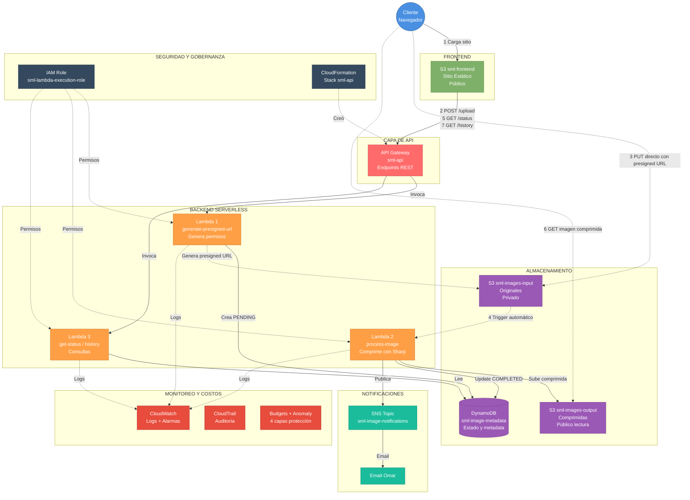
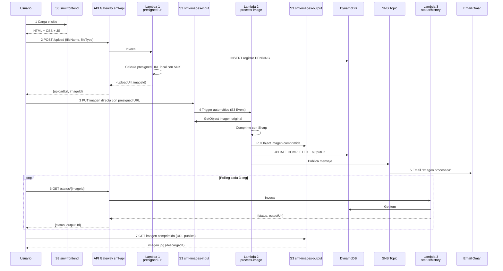

# Diagrama de Arquitectura — SmartMedia Labs

> Diagrama profesional de la plataforma serverless de procesamiento de imágenes.
> Tres versiones: Mermaid (auto-renderizable), receta para draw.io (la más bonita), y ASCII de respaldo.

---

## Version 1: Mermaid (lista para usar)

Este código se renderiza automáticamente en:
- GitHub al ver el archivo .md
- VS Code con la extensión "Markdown Preview Mermaid Support"
- Online: pegar en https://mermaid.live para verlo al instante



---

## Version 2: Diagrama detallado con flujo numerado

Para que sea fácil seguir el flujo paso a paso:



---

## Version 3: ASCII detallado (de respaldo)

Si Mermaid no se renderiza por algún motivo, este formato es universal.

```
                              ┌──────────────────┐
                              │     CLIENTE      │
                              │   (Navegador)    │
                              └────┬─────────────┘
                                   │
                ┌──────────────────┼──────────────────┐
                │                  │                  │
       (1) Carga sitio     (3) Upload imagen   (6) Descarga imagen
                │                  │                  │
                ▼                  ▼                  ▼
       ┌────────────────┐  ┌────────────────┐  ┌────────────────┐
       │ S3 sml-frontend│  │ S3 sml-images- │  │ S3 sml-images- │
       │  (público)     │  │ input          │  │ output         │
       │  Sitio web     │  │ (privado)      │  │ (público)      │
       └────────────────┘  └───┬────────────┘  └────────────────┘
              │                │                       ▲
              │                │ (4) trigger           │
              │                │     automático        │ Lambda 2 sube
              │                │                       │ comprimida
        (2) HTTP REST          ▼                       │
              │         ┌──────────────────────┐       │
              ▼         │   LAMBDA 2           │       │
      ┌──────────────┐  │   process-image      │───────┘
      │ API GATEWAY  │  │                      │
      │   sml-api    │  │ - Descarga original  │
      │              │  │ - Comprime (Sharp)   │
      │ /upload      │  │ - Sube comprimida    │
      │ /status/{id} │  │ - Actualiza DB       │
      │ /history     │  │ - Notifica SNS       │
      └──┬───────┬───┘  └────┬─────────┬───────┘
         │       │           │         │
   POST  │       │  GET      │         │
         ▼       ▼           ▼         ▼
    ┌─────────┐ ┌─────────┐  │    ┌────────┐
    │LAMBDA 1 │ │LAMBDA 3 │  │    │  SNS   │
    │presign  │ │status/  │  │    │ Topic  │
    │URL      │ │history  │  │    └───┬────┘
    └────┬────┘ └────┬────┘  │        │
         │           │       │        ▼
         │           │       │   ┌─────────┐
         │           │       │   │  Email  │
         │           │       │   │  Omar   │
         │           │       │   └─────────┘
         └───────────┼───────┘
                     │
                     ▼
           ┌──────────────────────┐
           │     DYNAMODB         │
           │  sml-image-metadata  │
           │                      │
           │  Lambda 1: INSERT    │
           │  Lambda 2: UPDATE    │
           │  Lambda 3: READ      │
           └──────────────────────┘

   COMPONENTES TRANSVERSALES (no en el flujo principal):

   ┌──────────────────────────────────────────────────────────────┐
   │  SEGURIDAD Y GOBERNANZA                                       │
   │                                                               │
   │  ┌──────────────────────┐   ┌────────────────────────────┐    │
   │  │ IAM Role             │   │ CloudFormation Stack       │    │
   │  │ sml-lambda-execution │   │ sml-api                    │    │
   │  │ (lo usan las 3       │   │ (creó toda la API)         │    │
   │  │  Lambdas)            │   │                            │    │
   │  └──────────────────────┘   └────────────────────────────┘    │
   └──────────────────────────────────────────────────────────────┘

   ┌──────────────────────────────────────────────────────────────┐
   │  MONITOREO Y COSTOS                                           │
   │                                                               │
   │  ┌──────────────┐  ┌──────────────┐  ┌──────────────────┐     │
   │  │ CloudWatch   │  │ CloudTrail   │  │ Budgets +        │     │
   │  │ Logs +       │  │ Auditoría    │  │ Anomaly Detect.  │     │
   │  │ Alarmas      │  │              │  │ 4 capas costo    │     │
   │  └──────────────┘  └──────────────┘  └──────────────────┘     │
   └──────────────────────────────────────────────────────────────┘
```

---

## Version 4: Receta para hacerlo en draw.io (recomendada para la presentación)

**draw.io** (también llamado diagrams.net) es gratis, tiene los íconos oficiales de AWS, y produce diagramas **estilo profesional** como los que mostró tu profesora.

### Pasos rápidos

1. Andá a https://app.diagrams.net (no requiere cuenta)
2. Elegí "Create New Diagram" → "Blank Diagram"
3. En el panel izquierdo, click en **"More Shapes"** (abajo) → marcá la categoría **"AWS"** → marcá **"AWS17 / AWS18 / AWS19"** (los más recientes) → OK
4. Ahora tenés todos los íconos oficiales en el panel izquierdo

### Componentes a colocar (de izquierda a derecha)

#### Columna 1 — Cliente
- **Cliente / Browser** (busca el ícono "User" o "Mobile")

#### Columna 2 — Frontend
- **S3** (busca "Simple Storage Service")
- Etiqueta: `S3 sml-frontend` (Sitio Estático)

#### Columna 3 — API Layer
- **API Gateway** (ícono violeta/morado)
- Etiqueta: `API Gateway sml-api`

#### Columna 4 — Compute
- **3 íconos Lambda** apilados verticalmente
- Etiquetas: `Lambda 1 - presigned-url`, `Lambda 2 - process-image`, `Lambda 3 - status/history`

#### Columna 5 — Storage
- **2 íconos S3**: `sml-images-input` y `sml-images-output`
- **1 ícono DynamoDB**: `sml-image-metadata`

#### Columna 6 — Notifications
- **SNS** (ícono rosa)
- **Email** (ícono de correo)

### Componentes transversales (poner abajo, separados)

Crea 2 rectángulos abajo del diagrama principal:

**Rectángulo 1: "Seguridad y Gobernanza"**
- **IAM Role** (ícono rojo)
- **CloudFormation** (ícono rosa)

**Rectángulo 2: "Monitoreo y Costos"**
- **CloudWatch** (ícono rosa con lupa)
- **CloudTrail** (ícono rosa con líneas)
- **AWS Budgets** (ícono verde)

### Flechas con etiquetas

Conectá los componentes con flechas. Etiquetá las flechas principales con números (1, 2, 3, 4, 5, 6) que representen el orden del flujo:

| # | Desde | Hasta | Etiqueta |
|---|-------|-------|----------|
| 1 | Cliente | S3 sml-frontend | Carga sitio |
| 2 | Cliente | API Gateway | POST /upload |
| 2.1 | API Gateway | Lambda 1 | Invoca |
| 2.2 | Lambda 1 | DynamoDB | INSERT PENDING |
| 2.3 | Lambda 1 | API Gateway | presigned URL |
| 3 | Cliente | S3 sml-images-input | PUT directo |
| 4 | S3 sml-images-input | Lambda 2 | Trigger |
| 4.1 | Lambda 2 | S3 sml-images-output | Sube comprimida |
| 4.2 | Lambda 2 | DynamoDB | UPDATE COMPLETED |
| 4.3 | Lambda 2 | SNS | Publica |
| 5 | SNS | Email | Notifica |
| 6 | Cliente | API Gateway | GET /status |
| 6.1 | API Gateway | Lambda 3 | Invoca |
| 6.2 | Lambda 3 | DynamoDB | READ |
| 7 | Cliente | S3 sml-images-output | GET imagen |

### Estilo recomendado

- **Tipografía:** Sans-serif (Arial, Roboto)
- **Líneas sólidas:** flujo principal (peticiones)
- **Líneas punteadas:** triggers automáticos, permisos
- **Colores:** dejar los oficiales de AWS por ícono (cada categoría tiene su color: compute=naranja, storage=verde, networking=morado, etc.)
- **Agrupaciones:** rectángulos con borde punteado para separar "Frontend", "Backend Serverless", "Storage", "Monitoreo"
- **Título:** "SmartMedia Labs - Arquitectura Serverless de Procesamiento de Imágenes"
- **Subtítulo:** "Plataforma event-driven en AWS"

### Tiempo estimado

Hacer el diagrama bonito en draw.io toma **30-45 minutos** la primera vez. Después de hacerlo, lo exportás como PNG o PDF para meter en presentación.

### Cómo exportarlo

1. File → Export As → PNG (alta resolución)
2. O File → Export As → PDF si lo querés imprimir
3. Save también el archivo .drawio por si lo querés editar después

---

## Notas para la presentación

### Lo que el diagrama tiene que comunicar

1. **El usuario interactúa con MÚLTIPLES puntos de AWS** (no solo el backend)
2. **El flujo es event-driven** (S3 dispara Lambda 2 automáticamente)
3. **Cada Lambda tiene un rol específico** (separación de responsabilidades)
4. **Las imágenes viajan DIRECTO a S3** (no pasan por backend, performance)
5. **Hay capas transversales** de seguridad y monitoreo que tocan todo

### El "pitch" usando el diagrama

> *"Acá ven la arquitectura completa. El cliente interactúa con tres puntos distintos de AWS: el bucket de frontend para cargar el sitio, API Gateway para iniciar el flujo de upload, y los buckets de imágenes directamente para subir y descargar — esto último es performance, evitamos que las imágenes pasen por nuestro backend.*
>
> *El backend es 100% serverless: tres Lambdas con responsabilidades separadas, todas usando un IAM Role compartido. La Lambda 1 da permisos para subir, la Lambda 2 procesa cuando S3 dispara el trigger automático, y la Lambda 3 atiende las consultas de estado.*
>
> *Como capas transversales tenemos seguridad (IAM Role, CloudFormation que versionó la API Gateway), notificaciones (SNS), almacenamiento (DynamoDB para metadata, S3 para archivos), y monitoreo (CloudWatch para logs, CloudTrail para auditoría, Budgets para protección de costos)."*

Eso es 60 segundos de explicación con el diagrama de fondo. Profesional.

---

## Archivos del proyecto

Este diagrama corresponde a la infraestructura documentada en `setup.md` y deployada vía `api-gateway.yaml`.

**ARN principal del proyecto:**
- Account ID: 372123585270
- Region: us-east-1
- API Gateway URL: https://bg7yhanxyg.execute-api.us-east-1.amazonaws.com/prod
